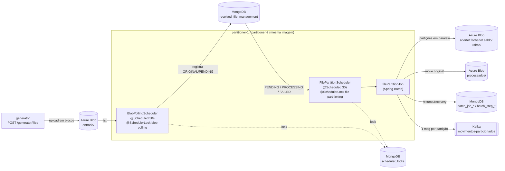
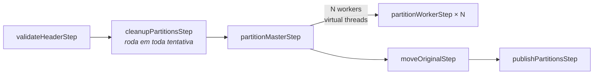

# Arquitetura

## Visão geral



As duas instâncias rodam os dois schedulers a cada 30 segundos, mas o ShedLock só deixa
**uma** executar cada ciclo. O polling e o particionamento usam locks diferentes: um
arquivo grande em processamento não bloqueia a descoberta de arquivos novos.

O polling só **registra** os arquivos. O particionamento consome a
`received_file_management`, não o blob. Assim, um arquivo que já saiu de `entrada/`
(movido para `processados/` antes de uma falha na publicação) continua recuperável.

## Job de particionamento



| Step | Responsabilidade | Classe |
|---|---|---|
| `validateHeaderStep` | Lê só os 19 primeiros bytes do blob, valida o header e o tamanho do arquivo contra o layout, e grava `movement` e `partitioning` no documento | `ValidateHeaderTasklet`, `FileInspector` |
| `cleanupPartitionsStep` | Se nenhuma tentativa anterior concluiu o `partitionMasterStep`, apaga as partições que sobraram (blob por prefixo + documentos) | `CleanupPartitionsTasklet`, `PartitionCleaner` |
| `partitionMasterStep` | Divide as linhas em N faixas (`app.partition.count`) e executa um worker por faixa em virtual threads | `FilePartitioner`, `PartitionPlan` |
| `partitionWorkerStep` | Grava o header e copia **só a faixa de bytes** da partição, do blob original para o blob de destino, em streaming | `PartitionWriterTasklet`, `PartitionBlobWriter` |
| `moveOriginalStep` | Move o original para `processados/` (cópia server-side + delete, idempotente) | `MoveOriginalTasklet`, `OriginalFileArchiver` |
| `publishPartitionsStep` | Publica 1 mensagem por partição ainda não publicada e aguarda o ack do broker | `PublishPartitionsTasklet`, `PartitionPublication` |

### Por que o particionamento é paralelo sem ler o arquivo inteiro

```
header  = H | yyyy-MM-dd | TIPO (7, padding) | \n  = 19 bytes
detalhe = 150 bytes                          | \n  = 151 bytes

linhas     = (tamanho do blob - 19) / 151
partição i = bytes [19 + primeiraLinha × 151, 19 + (primeiraLinha + linhas) × 151)
```

Como as linhas têm tamanho fixo, cada worker calcula a própria faixa de bytes e lê só
essa faixa do blob (HTTP range). As N partições são lidas e gravadas ao mesmo tempo. O
resto da divisão das linhas vai para as primeiras partições, uma linha a mais em cada.

### Upload em blocos e atomicidade de cada partição

`AzureBlockUpload` envia blocos de tamanho fixo (`stageBlock`) e só publica o blob no
`commit()` (`commitBlockList`). Consequências:

* **Memória limitada:** no máximo um buffer de upload e um de leitura por partição. Com 8 MB, são cerca de 16 MB por partição.
* **Sem arquivo parcial:** se um worker falha no meio, nada é visível no blob, porque os blocos não confirmados são descartados pela Azure.

O `BlobOutputStream` do SDK foi descartado porque enfileira blocos sem limite quando a
leitura é mais rápida que o upload. Com arquivos de 755 MB, ele causou `OutOfMemoryError`.

## Resume e recovery

A identidade do job é o parâmetro `fileId`, então cada arquivo tem uma única
`JobInstance` e cada tentativa é uma nova `JobExecution` dela.

| Onde falhou | O que acontece na próxima tentativa |
|---|---|
| `validateHeaderStep`, com `InvalidFileException` | Não há retentativa: o arquivo vai para `erros/` com status `ERROR` |
| `validateHeaderStep`, com erro transitório | Valida de novo |
| `partitionMasterStep` (qualquer worker) | O cleanup apaga as partições da tentativa anterior e **todos** os workers rodam de novo: o particionamento é tudo ou nada. Quem decide isso é o `SimpleStepExecutionSplitter` com `allowStartIfComplete=true`, configurado no master. Esse flag no worker é ignorado pelo splitter padrão, que retomaria só as partições que falharam |
| `moveOriginalStep` | Validação e particionamento são pulados (`COMPLETED`), o cleanup não apaga nada e o move é refeito. Se a cópia já existia e só faltava o delete, o move apenas conclui |
| `publishPartitionsStep` | Todos os passos anteriores são pulados e só as partições sem `published_at` são publicadas |
| Instância morreu no meio | O lock expira em `lock-at-most-for` e a outra instância assume. `AbandonedExecutionRecovery` marca a execução presa em `STARTED` como `FAILED` e o restart segue as regras acima |
| `max-attempts` esgotado | O original vai para `erros/`, as partições são apagadas se nenhuma tiver sido publicada, e o status vira `ERROR` |

A publicação é *at-least-once*: se o processo morrer entre o ack do Kafka e o commit no
Mongo, a mensagem é reenviada. O `blob_path` é único por partição e serve de chave de
idempotência para o consumidor.

## ShedLock com nomenclatura configurável

O `MongoLockProvider` oficial deixa trocar só o nome da collection. Os campos são fixos:
`_id`, `lockUntil`, `lockedAt` e `lockedBy`. `ConfigurableMongoLockProvider` implementa
`ExtensibleLockProvider` com o **mesmo algoritmo** do provider oficial, e `MongoLockStore`
faz as operações via `MongoTemplate`, usando os nomes definidos em `app.shedlock.*`:

| Operação | Filtro | Update |
|---|---|---|
| `lock` (upsert) | `name == X AND lock_until <= now` | `lock_until`, `locked_at`, `locked_by`. Duplicate key significa que o lock está ocupado |
| `extend` | `name == X AND lock_until > now AND locked_by == eu` | `lock_until` |
| `unlock` | `name == X` | `lock_until = max(now, lockAtLeastUntil)` |

* **Duplicate key:** se o campo do nome não for `_id`, o store cria um índice único nele. Sem esse índice, o upsert não gera duplicate key e duas instâncias conseguiriam o lock.
* **Write concern:** o `MongoTemplate` do lock usa `WriteConcern.MAJORITY`.
* **Keep-alive:** o `KeepAliveLockProvider` renova o lock a cada `lock-at-most-for / 2` enquanto o ciclo roda. Um arquivo grande não perde o lock, e um lock órfão expira em até `lock-at-most-for`.

```yaml
app:
  shedlock:
    collection: scheduler_locks
    fields:
      name: _id
      lock-until: lock_until
      locked-at: locked_at
      locked-by: locked_by
```

## Collections

| Collection | Conteúdo |
|---|---|
| `batch_job_instance`, `batch_job_execution`, `batch_step_execution`, `batch_sequences` | JobRepository customizado, mesma estrutura do `poc-spring-batch` (snake_case e TTL de expurgo) |
| `received_file_management` | Arquivo grande (`role=ORIGINAL`) e suas partições (`role=PARTITION`, `parent_file_id` = id do original) |
| `scheduler_locks` | Locks do ShedLock (nome e campos configuráveis) |

### `received_file_management`

```json
{
  "_id": "66851c48-fa5b-3cd8-9ace-de0a9de5d953",
  "role": "ORIGINAL",
  "parent_file_id": null,
  "file_name": "MOV_ABERTO_20260916_1789601662802_01.dat",
  "status": "COMPLETED",
  "blob": {
    "source_path": "entrada/MOV_ABERTO_20260916_1789601662802_01.dat",
    "current_path": "processados/2026-09-16/66851c48-.../MOV_ABERTO_20260916_1789601662802_01.dat",
    "etag": "0x24CEF87183CB480",
    "size_bytes": 755000019
  },
  "movement": { "header": "H2026-09-16ABERTO ", "type": "ABERTO", "date": "2026-09-16" },
  "partitioning": { "index": null, "count": 10, "line_count": 5000000, "byte_start": null, "byte_end": null },
  "execution": { "job_instance_id": 1, "last_job_execution_id": 1, "attempts": 1, "last_error": null, "duration_ms": 9120 },
  "audit": { "created_at": "...", "updated_at": "...", "published_at": null, "completed_at": "..." }
}
```

Uma partição tem `role=PARTITION`, `parent_file_id` apontando para o original,
`blob.current_path` na pasta do tipo de movimento, e `partitioning.index`,
`partitioning.byte_start` e `partitioning.byte_end` com a faixa copiada do original.
`audit.published_at` é preenchido após o ack do Kafka.

* **Id do original:** `UUID.nameUUIDFromBytes(caminho + etag)`. Registrar o mesmo blob de novo não faz nada, e um reenvio com o mesmo nome (outro etag) vira um novo arquivo.
* **Id da partição:** `<id do original>-p0001`.

## Pastas no blob

```
entrada/<arquivo>.dat                                   recebido, aguardando particionamento
processados/<data>/<fileId>/<arquivo>.dat               original já particionado
aberto|fechado|saldo|ultima/<data>/<fileId>/<arquivo>_part_0001.dat
erros/<fileId>/<arquivo>.dat                            inválido ou sem mais tentativas
```

O `fileId` no caminho das partições permite apagar todas as partições de um arquivo só
pelo prefixo, inclusive as que foram enviadas mas não chegaram a ser registradas no Mongo.

## Mensagem Kafka

Tópico `movimentos-particionados`, com 10 partições. A key é o nome do arquivo
particionado, o que distribui as mensagens entre as partições e permite consumo paralelo.

```json
{ "movement_type": "ABERTO", "blob_path": "aberto/2026-09-16/<fileId>/MOV_..._part_0001.dat", "movement_date": "2026-09-16" }
```

## Estrutura do código

```
br.com.spring.batch.partitioner
├── controller    REST: gerador, consulta/verificação de arquivos, locks, chaos
├── service       polling, ciclo de particionamento, launcher/runner do job, rejeição, status, verificação
│   └── generation  worker de geração de massa (profile generator)
├── scheduler     @Scheduled + @SchedulerLock e o LockedCycleRunner (request_id, log e auditoria do lock)
├── batch
│   ├── job         definição do job, nomes dos steps e JobParameters
│   ├── step        FileStep / FileStepSupport (carrega o arquivo e aplica o chaos)
│   ├── tasklet     um tasklet por step
│   ├── partition   inspeção, plano, escrita, limpeza, arquivamento e publicação das partições
│   ├── listener    status do arquivo e métricas (STEP_METRICS / JOB_METRICS)
│   ├── metrics     StepVolume e Throughput
│   └── recovery    execuções órfãs
├── repository    received_file_management (original e partições) e o JobRepository customizado (batch/)
├── model         documento Mongo, layout posicional, plano de partições e evento Kafka
├── storage       interfaces BlobCatalog/Reader/Writer/Mover e a implementação Azure
├── lock          LockProvider configurável do ShedLock
├── messaging     publicação no Kafka
├── config        beans e propriedades
└── support       log estruturado, request_id, retry do Mongo, chaos
```

Ver também: [TESTING.md](TESTING.md) · [OBSERVABILITY.md](OBSERVABILITY.md) · [README](../README.md).
