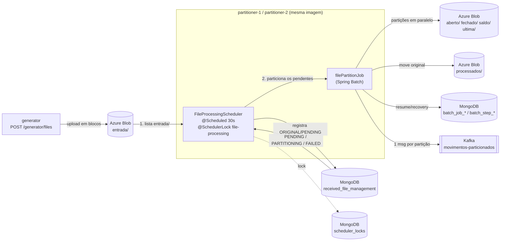
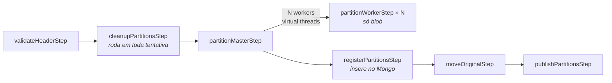

# Arquitetura

## Visão geral



As duas instâncias rodam o mesmo scheduler a cada 30 segundos, mas o ShedLock só deixa **uma**
executar cada ciclo. O ciclo faz as duas coisas em sequência: lista `entrada/` e registra os
arquivos novos, e em seguida particiona tudo que estiver pendente. Com isso, um arquivo recém
descoberto é particionado no mesmo ciclo, sem a espera de um ciclo para o outro.

O particionamento consome a `received_file_management`, não o blob. Assim, um arquivo que já saiu
de `entrada/` (movido para `processados/` antes de uma falha na publicação) continua recuperável,
e uma execução órfã de uma instância que morreu é retomada no ciclo seguinte.

## Quebra de linha configurável

Nem todo mainframe gera o arquivo com o mesmo terminador: alguns ambientes produzem **LF** (1 byte)
e outros **CRLF** (2 bytes). Como o particionamento calcula faixas de bytes sem ler o arquivo, essa
diferença muda toda a aritmética de offsets.

```yaml
app:
  file:
    line-separator: ${APP_FILE_LINE_SEPARATOR:LF}   # LF ou CRLF
```

O `FileLayout` deixou de ser uma classe de constantes estáticas e virou um value object construído a
partir dessa configuração. Todo o cálculo passa por ele:

| Medida | LF | CRLF |
|---|---|---|
| Linha de header | 19 bytes | 20 bytes |
| Linha de detalhe | 151 bytes | 152 bytes |
| Offset da linha N | `19 + N × 151` | `20 + N × 152` |

**Validação obrigatória.** Uma configuração errada não produz erro óbvio: ela desloca todos os
offsets e geraria partições corrompidas silenciosamente. Por isso o header é validado contra o
separador configurado na leitura — se o byte seguinte ao header não corresponder, o arquivo é
rejeitado como inválido:

```
quebra de linha do arquivo não corresponde ao layout configurado (LF): byte 18 é 0xd
```

Como o indicador `H` e o tamanho do header são fixos, essa verificação é determinística: o byte na
posição 18 é `0x0A` num arquivo LF e `0x0D` num arquivo CRLF. Uma troca de ambiente sem a
configuração correspondente falha no primeiro arquivo, e não depois de gravar partições erradas.

## Paralelismo do particionamento

São dois níveis, ambos com virtual threads:

1. **Entre partições:** o `partitionMasterStep` distribui as N partições (`app.partition.count`) em
   virtual threads, uma por partição.
2. **Dentro de cada partição:** cada partição divide sua faixa de bytes em
   `app.partition.threads-per-partition` trechos alinhados ao bloco de upload, e cada trecho é lido
   e enviado por uma virtual thread.

O segundo nível é seguro porque o Azure Blob monta o arquivo por *block list*: cada bloco é enviado
com um identificador próprio e a ordem final do arquivo é a do `commitBlockList`, não a ordem em que
os blocos chegaram. O `PartitionTransfer` calcula os índices de bloco de forma determinística — o
bloco 0 é o header e cada trecho conhece o índice do seu primeiro bloco — e só então faz o commit.
O arquivo resultante é idêntico ao do caminho sequencial, o que `PartitionTransferTest` verifica com
1, 2, 4 e 8 threads.

Como nenhum bloco é visível antes do commit, uma falha em qualquer trecho continua deixando o blob
inexistente, preservando a atomicidade por partição.

**Memória:** o custo é `partições × threads × app.blob.upload-block-size-mb`. Com 10 partições, 4
threads e blocos de 8 MB são 320 MB de buffers simultâneos, que precisam caber no limite do
container.

## Job de particionamento



| Step | Responsabilidade | Classe |
|---|---|---|
| `validateHeaderStep` | Lê só os 19 primeiros bytes do blob, valida o header e o tamanho do arquivo contra o layout, e grava `movement` e `partitioning` no documento | `ValidateHeaderTasklet`, `FileInspector` |
| `cleanupPartitionsStep` | Se nenhuma tentativa anterior concluiu o `partitionMasterStep`, apaga as partições que sobraram (blob por prefixo + documentos) | `CleanupPartitionsTasklet`, `PartitionCleaner` |
| `partitionMasterStep` | Divide as linhas em N faixas (`app.partition.count`) e executa um worker por faixa em virtual threads | `FilePartitioner`, `PartitionPlan` |
| `partitionWorkerStep` | Grava o header e copia **só a faixa de bytes** da partição, do blob original para o blob de destino, em streaming. **Não grava nada no Mongo** | `PartitionWriterTasklet`, `PartitionBlobWriter` |
| `registerPartitionsStep` | Só roda depois que **todas** as partições estão no blob. Confere se cada uma existe com o tamanho esperado e insere todos os documentos de uma vez (status `UPLOADED`) numa transação curta | `RegisterPartitionsTasklet`, `PartitionRegistration` |
| `moveOriginalStep` | Move o original para `processados/` (cópia server-side + delete, idempotente) | `MoveOriginalTasklet`, `OriginalFileArchiver` |
| `publishPartitionsStep` | Publica 1 mensagem por partição ainda não publicada, aguarda o ack do broker e só então marca `published_at` + `COMPLETED` | `PublishPartitionsTasklet`, `PartitionPublication` |

### Por que o particionamento é paralelo sem ler o arquivo inteiro

```
header  = H | yyyy-MM-dd | TIPO (7, padding) | \n  = 19 bytes
detalhe = 150 bytes                          | \n  = 151 bytes

linhas     = (tamanho do blob - 19) / 151
partição i = bytes [19 + primeiraLinha × 151, 19 + (primeiraLinha + linhas) × 151)
```

Como as linhas têm tamanho fixo, cada worker calcula a própria faixa de bytes e lê só
essa faixa do blob (HTTP range). As N partições são lidas e gravadas ao mesmo tempo. O
resto da divisão das linhas vai para as primeiras partições, uma linha a mais em cada.

### Upload em blocos e atomicidade de cada partição

`AzureBlockUpload` envia blocos de tamanho fixo (`stageBlock`) e só publica o blob no
`commit()` (`commitBlockList`). Consequências:

* **Memória limitada:** no máximo um buffer de upload e um de leitura por partição. Com 8 MB, são cerca de 16 MB por partição.
* **Sem arquivo parcial:** se um worker falha no meio, nada é visível no blob, porque os blocos não confirmados são descartados pela Azure.

O `BlobOutputStream` do SDK foi descartado porque enfileira blocos sem limite quando a
leitura é mais rápida que o upload. Com arquivos de 755 MB, ele causou `OutOfMemoryError`.

## Timeouts nas chamadas ao blob

Sem timeout, uma chamada travada ao storage prende o job indefinidamente: foi o que aconteceu num
teste de carga, em que um `OutOfMemoryError` dentro do SDK deixou o particionamento pendurado, com
CPU em 0,16% e sem progresso, em vez de falhar. O cliente do blob é construído com limites em dois
níveis:

| Fase da chamada | Parâmetro | Natureza |
|---|---|---|
| Estabelecer a conexão TCP | `connectTimeout` | Duração total da fase |
| Enviar o corpo da requisição | `writeTimeout` | **Ociosidade entre blocos** |
| Esperar os headers da resposta | `responseTimeout` | Duração total da fase |
| Ler o corpo da resposta | `readTimeout` | **Ociosidade entre blocos** |
| A tentativa inteira | `tryTimeout` (`RequestRetryOptions`) | **Duração total da tentativa** |

A distinção importa: `writeTimeout` e `readTimeout` medem **ociosidade entre blocos**, não duração
total. Uma transferência lenta que continua progredindo nunca é interrompida por eles — o que é
desejável, porque não mata o download legítimo de um arquivo grande, mas significa que sozinhos eles
não limitam o tempo total. Quem limita o total é o `tryTimeout`.

```yaml
app:
  blob:
    max-tries: 3
    try-timeout-seconds: 60        # teto de cada tentativa
    retry-delay-seconds: 2
    max-retry-delay-seconds: 30
    response-timeout-seconds: 60   # headers da resposta
    connect-timeout-seconds: 10    # estabelecer a conexão
```

### O escopo do `tryTimeout`

O `tryTimeout` vale para **uma requisição HTTP**, dimensionada pelo block size — não para o arquivo,
nem para o particionamento, nem para o job. No `RequestRetryPolicy` do SDK ele é aplicado como
`responseMono.timeout(tryTimeout)`, dentro da política de retry de cada chamada.

No 250MM com blocos de 8 MB, isso significa cerca de **9.400 requisições** (≈472 downloads e
≈472 uploads por partição, vezes 10 partições), cada uma com seu próprio teto de 60 s. É por isso
que o particionamento inteiro leva minutos sem nenhum timeout disparar.

Há uma assimetria entre as duas direções, porque o `responseMono` resolve quando a **resposta
chega**, não quando o corpo termina de ser lido:

* **Upload (`stageBlock`)**: o teto cobre a operação inteira, porque a resposta só vem depois de o
  servidor receber e processar o bloco.
* **Download**: o teto cobre até os **headers**. A transferência do corpo acontece depois e fica por
  conta do `readTimeout`, que é de ociosidade — mata a conexão que fica 60 s sem receber nada, mas
  não uma que esteja lenta e constante.

A proteção no download, portanto, vem da combinação dos dois: `tryTimeout` para a requisição não
ficar parada, `readTimeout` para o fluxo não congelar no meio. Nenhum deles sozinho cobriria o caso.

Com 3 tentativas, o pior caso de uma requisição antes de o erro subir para a aplicação é da ordem de
`maxTries × tryTimeout` = 3 minutos — e não 60 s, como a leitura apressada do parâmetro sugeriria.

**Dimensionamento:** os valores precisam acomodar o pior caso legítimo. No emulador um bloco de 8 MB
sobe em dezenas de milissegundos, mas contra o Azure real, com rede intermediando, o percentil alto
é bem maior. Os 60 s são folgados de propósito — o objetivo é **impedir o travamento infinito**, não
otimizar latência. Ajustar com dados de produção.

Os atrasos injetados pelos testes de caos acontecem no código da aplicação, não nas chamadas do SDK,
então não são interceptados por esses timeouts — o cenário `slow-io`, com 90 s de atraso, continua
concluindo na primeira tentativa.

## Transações do MongoDB

O limite de transação do MongoDB em produção é **60 s** (`transactionLifetimeLimitSeconds`), e o
docker-compose usa o mesmo valor. A regra do job é **nenhum I/O externo (blob ou Kafka) dentro de
transação do Mongo**:

* **Steps sem transação do Mongo:** todos os tasklets usam `ResourcelessTransactionManager`. O `MongoTemplate` usa `SessionSynchronization.ON_ACTUAL_TRANSACTION` e, sem transação nativa do Mongo, não abre sessão. Assim uma cópia de 1,5 GB ou um move de 15 GB não fica dentro de transação. As atualizações do `StepExecution` e do `ExecutionContext` são feitas pelo JobRepository em transações curtas próprias.
* **Onde há transação:** só em `registerPartitionsStep` (`PartitionFileRepository.replaceAll`: remove + insere todas as partições). Dura milissegundos e roda depois de todo o upload.
* **Demais gravações:** são operações únicas e atômicas por natureza (`updateOne` / `updateMany`), idempotentes em caso de restart.

O cenário `slow-io` do chaos test força 90 s de I/O no worker, no move e na publicação, e confere
que o arquivo termina na 1ª tentativa, sem `NoSuchTransaction`.

## Status

| Documento | Fluxo |
|---|---|
| Original | `PENDING` → `PARTITIONING` → `COMPLETED`, ou `FAILED` (retentativa) → `ERROR` (inválido ou tentativas esgotadas) |
| Partição | `UPLOADED` (inserida depois de todo o upload) → `COMPLETED` (depois do ack do Kafka, junto com `published_at`) |

A ordem **ack do Kafka → `published_at`/`COMPLETED`** é proposital. Se o processo morrer entre as
duas, a mensagem é reenviada no restart (duplicata, que o consumidor resolve pelo `blob_path`).
Na ordem inversa, a partição apareceria como publicada sem a mensagem ter sido entregue, e a
mensagem se perderia sem que desse para detectar.

## Resume e recovery

A identidade do job é o parâmetro `fileId`, então cada arquivo tem uma única
`JobInstance` e cada tentativa é uma nova `JobExecution` dela.

| Onde falhou | O que acontece na próxima tentativa |
|---|---|
| `validateHeaderStep`, com `InvalidFileException` | Não há retentativa: o arquivo vai para `erros/` com status `ERROR` |
| `validateHeaderStep`, com erro transitório | Valida de novo |
| `partitionMasterStep` (qualquer worker) | O cleanup apaga as partições da tentativa anterior e **todos** os workers rodam de novo: o particionamento é tudo ou nada. Quem decide isso é o `SimpleStepExecutionSplitter` com `allowStartIfComplete=true`, configurado no master. Esse flag no worker é ignorado pelo splitter padrão, que retomaria só as partições que falharam |
| `registerPartitionsStep` | Particionamento pulado (`COMPLETED`), o cleanup não apaga nada e o registro é refeito. É idempotente: remove e insere de novo. Se alguma partição não estiver no blob, o step falha até esgotar as tentativas |
| `moveOriginalStep` | Validação e particionamento são pulados (`COMPLETED`), o cleanup não apaga nada e o move é refeito. Se a cópia já existia e só faltava o delete, o move apenas conclui |
| `publishPartitionsStep` | Todos os passos anteriores são pulados e só as partições sem `published_at` são publicadas |
| Instância morreu no meio | O lock expira em `lock-at-most-for` e a outra instância assume. `AbandonedExecutionRecovery` marca a execução presa em `STARTED` como `FAILED` e o restart segue as regras acima |
| `max-attempts` esgotado | O original vai para `erros/`, as partições são apagadas se nenhuma tiver sido publicada, e o status vira `ERROR` |

A publicação é *at-least-once*: se o processo morrer entre o ack do Kafka e o commit no
Mongo, a mensagem é reenviada. O `blob_path` é único por partição e serve de chave de
idempotência para o consumidor.

## ShedLock: um lock por tipo de movimento

Não existe lock de ciclo. Cada tipo de movimento tem o seu próprio lock, derivado de
`app.scheduler.file-processing.lock-name`:

| Lock | Protege |
|---|---|
| `file-processing-poll` | A listagem do blob e o registro dos arquivos novos |
| `file-processing-fechado` | O processamento dos arquivos FECHADO |
| `file-processing-aberto` | O processamento dos arquivos ABERTO |
| `file-processing-ultima` | O processamento dos arquivos ULTIMA |
| `file-processing-saldo` | O processamento dos arquivos SALDO |
| `file-processing-desconhecido` | Arquivos que o poll não conseguiu classificar |

O efeito é duplo:

* **Tipos diferentes rodam em paralelo**, inclusive em instâncias diferentes, porque cada um disputa
  um lock distinto. É o que permite duas instâncias trabalharem ao mesmo tempo.
* **O mesmo tipo nunca roda duas vezes em paralelo**, o que preserva a ordem por data dentro do
  tipo: o FECHADO de 18/09 termina antes de o de 19/09 começar.

Dentro de um lock, todos os arquivos pendentes daquele tipo são processados em sequência, na ordem
da fila, sem soltar e readquirir o lock a cada arquivo.

`app.partition.max-concurrent-types` limita quantos tipos uma única instância processa ao mesmo
tempo (padrão `1`). O paralelismo entre instâncias não depende dessa configuração.

O registro dos arquivos é idempotente (`insertIfAbsent`), então o lock de poll existe apenas para
evitar listagens redundantes do blob, não por correção.

Como cada lock é adquirido pela API programática do ShedLock (`LockingTaskExecutor`), a validade é
a mesma do lock de ciclo anterior (`lock-at-most-for`), renovada pelo keep-alive enquanto o
processamento durar.

A collection e os nomes dos campos continuam configuráveis por `app.shedlock.*`, com o provider
próprio descrito abaixo.

### Concorrência na criação de jobs

Com duas instâncias lançando jobs ao mesmo tempo, duas corridas ficam expostas nas collections do
Spring Batch:

1. **Criação duplicada de `JobInstance`.** O DAO verifica a existência e insere em seguida — entre
   as duas operações, outra instância pode inserir a mesma chave. Um **índice único em
   `(job_name, job_key)`** (criado no `mongo-init`) transforma a corrida em erro de chave duplicada.
   A aplicação trata esse erro como `CONCURRENT_LAUNCH`: devolve o arquivo para `PENDING`, **desconta
   a tentativa** — porque nada chegou a ser executado — e deixa o próximo ciclo reprocessar.
2. **`JobInstance` sem execução.** Se o lançamento falha entre criar a instância e gravar a execução,
   sobra uma instância órfã, e todas as tentativas seguintes falham com
   `Cannot find any job execution for job instance`. O `OrphanJobInstanceCleaner` descarta, antes de
   lançar, apenas instâncias **sem nenhuma execução** — que não carregam estado algum. Instâncias com
   execuções são preservadas, mantendo intacto o caminho de resume.

Por esse motivo o lançamento do job **não é envolvido em retry**: criar uma `JobInstance` não é
idempotente, e repetir a operação após uma falha parcial era o que produzia a instância órfã. Um
erro transitório agora custa um ciclo, e o arquivo volta pela fila normalmente.

### Provider customizado

O `MongoLockProvider` oficial deixa trocar só o nome da collection. Os campos são fixos:
`_id`, `lockUntil`, `lockedAt` e `lockedBy`. `ConfigurableMongoLockProvider` implementa
`ExtensibleLockProvider` com o **mesmo algoritmo** do provider oficial, e `MongoLockStore`
faz as operações via `MongoTemplate`, usando os nomes definidos em `app.shedlock.*`:

| Operação | Filtro | Update |
|---|---|---|
| `lock` (upsert) | `name == X AND lock_until <= now` | `lock_until`, `locked_at`, `locked_by`. Duplicate key significa que o lock está ocupado |
| `extend` | `name == X AND lock_until > now AND locked_by == eu` | `lock_until` |
| `unlock` | `name == X` | `lock_until = max(now, lockAtLeastUntil)` |

* **Duplicate key:** se o campo do nome não for `_id`, o store cria um índice único nele. Sem esse índice, o upsert não gera duplicate key e duas instâncias conseguiriam o lock.
* **Write concern:** o `MongoTemplate` do lock usa `WriteConcern.MAJORITY`.
* **Keep-alive:** o `KeepAliveLockProvider` renova o lock a cada `lock-at-most-for / 2` enquanto o processamento roda. Um arquivo grande não perde o lock, e um lock órfão expira em até `lock-at-most-for`.

```yaml
app:
  shedlock:
    collection: scheduler_locks
    fields:
      name: _id
      lock-until: lock_until
      locked-at: locked_at
      locked-by: locked_by
```


## Infraestrutura criada fora da aplicação

A aplicação **não cria nada** no startup: nem collection, nem índice, nem tópico, nem container do
blob. Se algo não existir, a operação falha e o problema aparece no log, em vez de a aplicação
criar um recurso com a configuração errada em produção.

| Recurso | Quem cria | Script |
|---|---|---|
| Replica set, collections (`batch_*`, `received_file_management`, `scheduler_locks`), sequences e índices | `mongo-init` | [`docker/mongo-init.sh`](../docker/mongo-init.sh) + [`docker/mongo-collections.js`](../docker/mongo-collections.js) |
| Índices TTL de expurgo do JobRepository | `mongo-init` | [`docker/mongo-ttl-indexes.js`](../docker/mongo-ttl-indexes.js) |
| Tópico `movimentos-particionados` (10 partições) | `kafka-init` | [`docker/kafka-init.sh`](../docker/kafka-init.sh) |
| Container `movimentos` no blob | `azurite-init` | [`docker/azurite-init.sh`](../docker/azurite-init.sh) |

Os três rodam como containers de init no compose, e o generator e os particionadores só sobem
depois que eles terminam (`service_completed_successfully`). Os scripts são idempotentes, então
`make infra-init` pode ser reexecutado. O índice único do lock só é criado quando
`app.shedlock.fields.name` não é `_id`, que é a mesma condição que o provider exige.

## Collections

| Collection | Conteúdo |
|---|---|
| `batch_job_instance`, `batch_job_execution`, `batch_step_execution`, `batch_sequences` | JobRepository customizado, mesma estrutura do `poc-spring-batch` (snake_case e TTL de expurgo) |
| `received_file_management` | Arquivo grande (`role=ORIGINAL`) e suas partições (`role=PARTITION`, `parent_file_id` = id do original) |
| `scheduler_locks` | Locks do ShedLock (nome e campos configuráveis) |

### `received_file_management`

```json
{
  "_id": "66851c48-fa5b-3cd8-9ace-de0a9de5d953",
  "role": "ORIGINAL",
  "parent_file_id": null,
  "file_name": "MOV_ABERTO_20260916_1789601662802_01.txt",
  "status": "COMPLETED",
  "blob": {
    "source_path": "entrada/MOV_ABERTO_20260916_1789601662802_01.txt",
    "current_path": "processados/2026-09-16/66851c48-.../MOV_ABERTO_20260916_1789601662802_01.txt",
    "etag": "0x24CEF87183CB480",
    "size_bytes": 755000019
  },
  "movement": { "header": "H2026-09-16ABERTO ", "type": "ABERTO", "date": "2026-09-16" },
  "partitioning": { "index": null, "count": 10, "line_count": 5000000, "byte_start": null, "byte_end": null },
  "execution": { "job_instance_id": 1, "last_job_execution_id": 1, "attempts": 1, "last_error": null, "duration_ms": 9120 },
  "audit": { "created_at": "...", "updated_at": "...", "published_at": null, "completed_at": "..." }
}
```

Uma partição tem `role=PARTITION`, `parent_file_id` apontando para o original,
`blob.current_path` na pasta do tipo de movimento, e `partitioning.index`,
`partitioning.byte_start` e `partitioning.byte_end` com a faixa copiada do original.
`audit.published_at` é preenchido após o ack do Kafka.

* **Id do original:** `UUID.nameUUIDFromBytes(caminho + etag)`. Registrar o mesmo blob de novo não faz nada, e um reenvio com o mesmo nome (outro etag) vira um novo arquivo.
* **Id da partição:** `<id do original>-p0001`.

## Pastas no blob

```
entrada/<arquivo>.txt                                   recebido, aguardando particionamento
processados/<data>/<fileId>/<arquivo>.txt               original já particionado
aberto|fechado|saldo|ultima/<data>/<fileId>/<arquivo>_part_0001.txt
erros/<fileId>/<arquivo>.txt                            inválido ou sem mais tentativas
```

O `fileId` no caminho das partições permite apagar todas as partições de um arquivo só
pelo prefixo, inclusive as que foram enviadas mas não chegaram a ser registradas no Mongo.

## Mensagem Kafka

Tópico `movimentos-particionados`, com 10 partições. A key é o nome do arquivo
particionado, o que distribui as mensagens entre as partições e permite consumo paralelo.

```json
{ "movement_type": "ABERTO", "blob_path": "aberto/2026-09-16/<fileId>/MOV_..._part_0001.txt", "movement_date": "2026-09-16" }
```

## Estrutura do código

```
br.com.spring.batch.partitioner
├── controller    REST: gerador, consulta/verificação de arquivos, locks, chaos
├── service       polling, ciclo de particionamento, launcher/runner do job, rejeição, status, verificação
│   └── generation  worker de geração de massa (profile generator)
├── scheduler     FileProcessingScheduler (@Scheduled + @SchedulerLock) e o LockedCycleRunner (request_id, log e auditoria do lock)
├── batch
│   ├── job         definição do job, nomes dos steps e JobParameters
│   ├── step        FileStep / FileStepSupport (carrega o arquivo e aplica o chaos)
│   ├── tasklet     um tasklet por step
│   ├── partition   inspeção, plano, escrita, limpeza, arquivamento e publicação das partições
│   ├── listener    status do arquivo e métricas (STEP_METRICS / JOB_METRICS)
│   ├── metrics     StepVolume e Throughput
│   └── recovery    execuções órfãs
├── repository    received_file_management (original e partições) e o JobRepository customizado (batch/)
├── model         documento Mongo, layout posicional, plano de partições e evento Kafka
├── storage       interfaces BlobCatalog/Reader/Writer/Mover e a implementação Azure
├── lock          LockProvider configurável do ShedLock
├── messaging     publicação no Kafka
├── config        beans e propriedades
└── support       log estruturado, request_id, retry do Mongo, chaos
```

Ver também: [TESTING.md](TESTING.md) · [OBSERVABILITY.md](OBSERVABILITY.md) · [README](../README.md).
