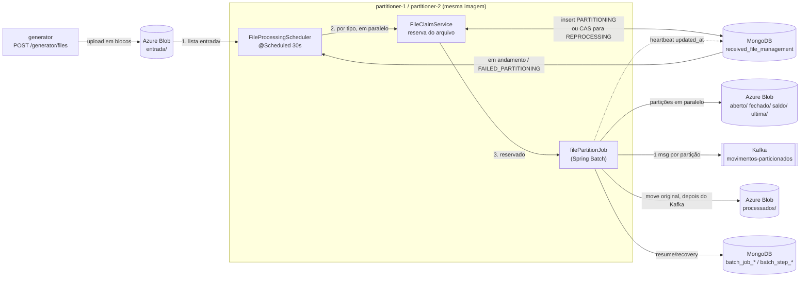
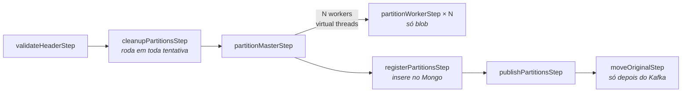

# Arquitetura

## Visão geral



As duas instâncias rodam o mesmo scheduler a cada 30 segundos, **sem lock** no modo padrão
(`CLAIM`). Em cada ciclo, a instância:

1. **Lista todos os arquivos de `entrada/`**, sem limite, e acrescenta os documentos do Mongo que
   ainda não terminaram (`PARTITIONING`, `REPROCESSING`, `FAILED_PARTITIONING`). Esse acréscimo
   cobre o arquivo que já foi movido para `processados/` mas não chegou a ser marcado `COMPLETED`.
2. **Agrupa por tipo de movimento** e processa os tipos em paralelo; dentro de um tipo, os arquivos
   vão um de cada vez. Não há ordenação por data nem dependência entre tipos.
3. **Reserva cada arquivo** antes de rodar o job. Quem não consegue a reserva registra no log e
   segue para o próximo arquivo. Ver [Controle de concorrência](#controle-de-concorrência).

Um arquivo com falha **permanece em `entrada/`**. Ele é retomado automaticamente enquanto houver
tentativas (`FAILED_PARTITIONING`) e, esgotadas as tentativas, fica em `FAILED` aguardando
tratativa manual — sem bloquear nenhum outro arquivo.

## Quebra de linha configurável

Nem todo mainframe gera o arquivo com o mesmo terminador: alguns ambientes produzem **LF** (1 byte)
e outros **CRLF** (2 bytes). Como o particionamento calcula faixas de bytes sem ler o arquivo, essa
diferença muda toda a aritmética de offsets.

```yaml
app:
  file:
    line-separator: ${APP_FILE_LINE_SEPARATOR:LF}   # LF ou CRLF
```

O `FileLayout` deixou de ser uma classe de constantes estáticas e virou um value object construído a
partir dessa configuração. Todo o cálculo passa por ele:

| Medida | LF | CRLF |
|---|---|---|
| Linha de header | 19 bytes | 20 bytes |
| Linha de detalhe | 151 bytes | 152 bytes |
| Offset da linha N | `19 + N × 151` | `20 + N × 152` |

**Validação obrigatória.** Uma configuração errada não produz erro óbvio: ela desloca todos os
offsets e geraria partições corrompidas silenciosamente. Por isso o header é validado contra o
separador configurado na leitura — se o byte seguinte ao header não corresponder, o arquivo é
rejeitado como inválido:

```
quebra de linha do arquivo não corresponde ao layout configurado (LF): byte 18 é 0xd
```

Como o indicador `H` e o tamanho do header são fixos, essa verificação é determinística: o byte na
posição 18 é `0x0A` num arquivo LF e `0x0D` num arquivo CRLF. Uma troca de ambiente sem a
configuração correspondente falha no primeiro arquivo, e não depois de gravar partições erradas.

## Paralelismo do particionamento

São dois níveis, ambos com virtual threads:

1. **Entre partições:** o `partitionMasterStep` distribui as N partições (`app.partition.count`) em
   virtual threads, uma por partição.
2. **Dentro de cada partição:** cada partição divide sua faixa de bytes em
   `app.partition.threads-per-partition` trechos alinhados ao bloco de upload, e cada trecho é lido
   e enviado por uma virtual thread.

O segundo nível é seguro porque o Azure Blob monta o arquivo por *block list*: cada bloco é enviado
com um identificador próprio e a ordem final do arquivo é a do `commitBlockList`, não a ordem em que
os blocos chegaram. O `PartitionTransfer` calcula os índices de bloco de forma determinística — o
bloco 0 é o header e cada trecho conhece o índice do seu primeiro bloco — e só então faz o commit.
O arquivo resultante é idêntico ao do caminho sequencial, o que `PartitionTransferTest` verifica com
1, 2, 4 e 8 threads.

Como nenhum bloco é visível antes do commit, uma falha em qualquer trecho continua deixando o blob
inexistente, preservando a atomicidade por partição.

**Memória:** o custo é `partições × threads × app.blob.upload-block-size-mb`. Com 10 partições, 4
threads e blocos de 8 MB são 320 MB de buffers simultâneos, que precisam caber no limite do
container.

## Job de particionamento



| Step | Responsabilidade | Classe |
|---|---|---|
| `validateHeaderStep` | Lê só os 19 primeiros bytes do blob, valida o header e o tamanho do arquivo contra o layout, e grava `movement` e `partitioning` no documento | `ValidateHeaderTasklet`, `FileInspector` |
| `cleanupPartitionsStep` | Se nenhuma tentativa anterior concluiu o `partitionMasterStep`, apaga as partições que sobraram (blob por prefixo + documentos) | `CleanupPartitionsTasklet`, `PartitionCleaner` |
| `partitionMasterStep` | Divide as linhas em N faixas (`app.partition.count`) e executa um worker por faixa em virtual threads | `FilePartitioner`, `PartitionPlan` |
| `partitionWorkerStep` | Grava o header e copia **só a faixa de bytes** da partição, do blob original para o blob de destino, em streaming. **Não grava nada no Mongo** | `PartitionWriterTasklet`, `PartitionBlobWriter` |
| `registerPartitionsStep` | Só roda depois que **todas** as partições estão no blob. Confere se cada uma existe com o tamanho esperado e insere todos os documentos de uma vez (status `UPLOADED`) numa transação curta | `RegisterPartitionsTasklet`, `PartitionRegistration` |
| `publishPartitionsStep` | Publica 1 mensagem por partição ainda não publicada, aguarda o ack do broker e só então marca `published_at` + `COMPLETED` | `PublishPartitionsTasklet`, `PartitionPublication` |
| `moveOriginalStep` | Move o original para `processados/` (cópia server-side + delete, idempotente). É o último passo: enquanto houver falha, o original continua em `entrada/` | `MoveOriginalTasklet`, `OriginalFileArchiver` |

### Por que o particionamento é paralelo sem ler o arquivo inteiro

```
header  = H | yyyy-MM-dd | TIPO (7, padding) | \n  = 19 bytes
detalhe = 150 bytes                          | \n  = 151 bytes

linhas     = (tamanho do blob - 19) / 151
partição i = bytes [19 + primeiraLinha × 151, 19 + (primeiraLinha + linhas) × 151)
```

Como as linhas têm tamanho fixo, cada worker calcula a própria faixa de bytes e lê só
essa faixa do blob (HTTP range). As N partições são lidas e gravadas ao mesmo tempo. O
resto da divisão das linhas vai para as primeiras partições, uma linha a mais em cada.

### Upload em blocos e atomicidade de cada partição

`AzureBlockUpload` envia blocos de tamanho fixo (`stageBlock`) e só publica o blob no
`commit()` (`commitBlockList`). Consequências:

* **Memória limitada:** no máximo um buffer de upload e um de leitura por partição. Com 8 MB, são cerca de 16 MB por partição.
* **Sem arquivo parcial:** se um worker falha no meio, nada é visível no blob, porque os blocos não confirmados são descartados pela Azure.

O `BlobOutputStream` do SDK foi descartado porque enfileira blocos sem limite quando a
leitura é mais rápida que o upload. Com arquivos de 755 MB, ele causou `OutOfMemoryError`.

## Timeouts nas chamadas ao blob

Sem timeout, uma chamada travada ao storage prende o job indefinidamente: foi o que aconteceu num
teste de carga, em que um `OutOfMemoryError` dentro do SDK deixou o particionamento pendurado, com
CPU em 0,16% e sem progresso, em vez de falhar. O cliente do blob é construído com limites em dois
níveis:

| Fase da chamada | Parâmetro | Natureza |
|---|---|---|
| Estabelecer a conexão TCP | `connectTimeout` | Duração total da fase |
| Enviar o corpo da requisição | `writeTimeout` | **Ociosidade entre blocos** |
| Esperar os headers da resposta | `responseTimeout` | Duração total da fase |
| Ler o corpo da resposta | `readTimeout` | **Ociosidade entre blocos** |
| A tentativa inteira | `tryTimeout` (`RequestRetryOptions`) | **Duração total da tentativa** |

A distinção importa: `writeTimeout` e `readTimeout` medem **ociosidade entre blocos**, não duração
total. Uma transferência lenta que continua progredindo nunca é interrompida por eles — o que é
desejável, porque não mata o download legítimo de um arquivo grande, mas significa que sozinhos eles
não limitam o tempo total. Quem limita o total é o `tryTimeout`.

```yaml
app:
  blob:
    max-tries: 3
    try-timeout-seconds: 60        # teto de cada tentativa
    retry-delay-seconds: 2
    max-retry-delay-seconds: 30
    response-timeout-seconds: 60   # headers da resposta
    connect-timeout-seconds: 10    # estabelecer a conexão
```

### O escopo do `tryTimeout`

O `tryTimeout` vale para **uma requisição HTTP**, dimensionada pelo block size — não para o arquivo,
nem para o particionamento, nem para o job. No `RequestRetryPolicy` do SDK ele é aplicado como
`responseMono.timeout(tryTimeout)`, dentro da política de retry de cada chamada.

No 250MM com blocos de 8 MB, isso significa cerca de **9.400 requisições** (≈472 downloads e
≈472 uploads por partição, vezes 10 partições), cada uma com seu próprio teto de 60 s. É por isso
que o particionamento inteiro leva minutos sem nenhum timeout disparar.

Há uma assimetria entre as duas direções, porque o `responseMono` resolve quando a **resposta
chega**, não quando o corpo termina de ser lido:

* **Upload (`stageBlock`)**: o teto cobre a operação inteira, porque a resposta só vem depois de o
  servidor receber e processar o bloco.
* **Download**: o teto cobre até os **headers**. A transferência do corpo acontece depois e fica por
  conta do `readTimeout`, que é de ociosidade — mata a conexão que fica 60 s sem receber nada, mas
  não uma que esteja lenta e constante.

A proteção no download, portanto, vem da combinação dos dois: `tryTimeout` para a requisição não
ficar parada, `readTimeout` para o fluxo não congelar no meio. Nenhum deles sozinho cobriria o caso.

Com 3 tentativas, o pior caso de uma requisição antes de o erro subir para a aplicação é da ordem de
`maxTries × tryTimeout` = 3 minutos — e não 60 s, como a leitura apressada do parâmetro sugeriria.

**Dimensionamento:** os valores precisam acomodar o pior caso legítimo. No emulador um bloco de 8 MB
sobe em dezenas de milissegundos, mas contra o Azure real, com rede intermediando, o percentil alto
é bem maior. Os 60 s são folgados de propósito — o objetivo é **impedir o travamento infinito**, não
otimizar latência. Ajustar com dados de produção.

Os atrasos injetados pelos testes de caos acontecem no código da aplicação, não nas chamadas do SDK,
então não são interceptados por esses timeouts — o cenário `slow-io`, com 90 s de atraso, continua
concluindo na primeira tentativa.

## Transações do MongoDB

O limite de transação do MongoDB em produção é **60 s** (`transactionLifetimeLimitSeconds`), e o
docker-compose usa o mesmo valor. A regra do job é **nenhum I/O externo (blob ou Kafka) dentro de
transação do Mongo**:

* **Steps sem transação do Mongo:** todos os tasklets usam `ResourcelessTransactionManager`. O `MongoTemplate` usa `SessionSynchronization.ON_ACTUAL_TRANSACTION` e, sem transação nativa do Mongo, não abre sessão. Assim uma cópia de 1,5 GB ou um move de 15 GB não fica dentro de transação. As atualizações do `StepExecution` e do `ExecutionContext` são feitas pelo JobRepository em transações curtas próprias.
* **Onde há transação:** só em `registerPartitionsStep` (`PartitionFileRepository.replaceAll`: remove + insere todas as partições). Dura milissegundos e roda depois de todo o upload.
* **Demais gravações:** são operações únicas e atômicas por natureza (`updateOne` / `updateMany`), idempotentes em caso de restart.
* **Sequências de id do JobRepository (`batch_sequences`) ficam fora da transação.** O `CustomSequenceIncrementer` usa um `MongoTemplate` próprio com `SessionSynchronization.NEVER`. Dentro da transação, todo job disputava o mesmo documento de sequência, e dois jobs simultâneos terminavam em `NoSuchTransaction` (`TransientTransactionError`) no `partitionMasterStep`, que cria as 10 step executions de uma vez. Fora da transação, o `$inc` continua atômico; o único efeito é uma lacuna na numeração quando a transação é desfeita, como numa sequence de banco.

O cenário `slow-io` do chaos test força 90 s de I/O no worker, no move e na publicação, e confere
que o arquivo termina na 1ª tentativa, sem `NoSuchTransaction`.

## Status

| Documento | Fluxo |
|---|---|
| Original | `PARTITIONING` → `COMPLETED`; em falha, `FAILED_PARTITIONING` → `REPROCESSING` → `COMPLETED`; tentativas esgotadas ou arquivo inválido → `FAILED` |
| Partição | `UPLOADED` (inserida depois de todo o upload) → `COMPLETED` (depois do ack do Kafka, junto com `published_at`) |

| Status do original | Significado | O ciclo faz |
|---|---|---|
| `PARTITIONING` | Primeira execução em andamento | Pula; retoma se o `updated_at` estiver parado há mais de `stale-after` |
| `REPROCESSING` | Retomada em andamento | Igual ao `PARTITIONING` |
| `FAILED_PARTITIONING` | Falhou e ainda tem tentativas | Reserva e retoma do passo que falhou |
| `FAILED` | Tentativas esgotadas ou header inválido | Pula até `POST /files/{id}/requeue` |
| `COMPLETED` | Publicado no Kafka e movido para `processados/` | — |

A ordem **ack do Kafka → `published_at`/`COMPLETED`** é proposital. Se o processo morrer entre as
duas, a mensagem é reenviada no restart (duplicata, que o consumidor resolve pelo `blob_path`).
Na ordem inversa, a partição apareceria como publicada sem a mensagem ter sido entregue, e a
mensagem se perderia sem que desse para detectar.

## Resume e recovery

A identidade do job é o parâmetro `fileId`, então cada arquivo tem uma única
`JobInstance` e cada tentativa é uma nova `JobExecution` dela. A ordem dos steps é
validar → limpar → particionar → registrar → **publicar no Kafka → mover para `processados/`**:
o original só sai de `entrada/` depois que todas as mensagens foram confirmadas.

| Onde falhou | O que acontece na próxima tentativa |
|---|---|
| `validateHeaderStep`, com `InvalidFileException` | Não há retentativa: `FAILED` direto, arquivo mantido em `entrada/` |
| `validateHeaderStep`, com erro transitório | Valida de novo |
| `partitionMasterStep` (qualquer worker) | O cleanup apaga as partições da tentativa anterior e **todos** os workers rodam de novo: o particionamento é tudo ou nada. Quem decide isso é o `SimpleStepExecutionSplitter` com `allowStartIfComplete=true`, configurado no master. Esse flag no worker é ignorado pelo splitter padrão, que retomaria só as partições que falharam |
| `registerPartitionsStep` | Particionamento pulado (`COMPLETED`), o cleanup não apaga nada e o registro é refeito. É idempotente: remove e insere de novo |
| `publishPartitionsStep` | Todos os passos anteriores são pulados e só as partições sem `published_at` são publicadas |
| `moveOriginalStep` | Tudo antes é pulado e o move é refeito. Se a cópia já existia e só faltava o delete, o move apenas conclui |
| Instância morreu no meio | O heartbeat para, o `updated_at` envelhece e, depois de `stale-after`, outra instância reserva o arquivo em `REPROCESSING`. O `AbandonedExecutionRecovery` marca a execução presa em `STARTED` como `FAILED` e o restart segue as regras acima |
| `max-attempts` esgotado | `FAILED`. O arquivo e as partições já criadas ficam como estão, para a tratativa manual |

Cada reserva conta uma tentativa, inclusive a retomada de uma instância que caiu. Um arquivo que
derruba o pod sempre (falta de memória, por exemplo) vira `FAILED` depois de `max-attempts`, em
vez de ficar em loop.

A tratativa manual tem dois caminhos: `POST /files/{id}/requeue` (de `FAILED` para
`FAILED_PARTITIONING`, com as tentativas zeradas), quando a causa foi resolvida fora do arquivo; ou o
reprocessamento pelo mainframe, que gera um arquivo com **outro nome** e, portanto, um registro novo.

A publicação é *at-least-once*: se o processo morrer entre o ack do Kafka e o commit no
Mongo, a mensagem é reenviada. O `blob_path` é único por partição e serve de chave de
idempotência para o consumidor.

## Controle de concorrência

```yaml
app:
  partition:
    concurrency-control: ${APP_PARTITION_CONCURRENCY_CONTROL:CLAIM}   # CLAIM | TYPE_LOCK | GLOBAL_LOCK
    max-concurrent-types: ${APP_PARTITION_MAX_CONCURRENT_TYPES:1}
    heartbeat-interval: ${APP_PARTITION_HEARTBEAT_INTERVAL:10s}
    stale-after: ${APP_PARTITION_STALE_AFTER:2m}
```

| Modo | Lock | Comportamento |
|---|---|---|
| `CLAIM` (padrão) | nenhum | Tipos em paralelo; a reserva no próprio documento do arquivo garante que só uma instância processe cada arquivo |
| `TYPE_LOCK` | ShedLock por tipo (`file-processing-<tipo>`) | Tipos em paralelo, e o mesmo tipo nunca roda em duas instâncias ao mesmo tempo |
| `GLOBAL_LOCK` | ShedLock único (`file-processing`) | Um arquivo por vez no cluster inteiro |

A reserva descrita abaixo roda nos três modos; os locks são uma camada a mais, não um substituto.

`max-concurrent-types` limita quantos tipos **uma** instância processa ao mesmo tempo. No `CLAIM`,
duas instâncias podem processar dois arquivos do **mesmo** tipo em paralelo — quem perde a reserva
do primeiro segue para o segundo. Com um arquivo por tipo por dia isso só acontece quando há um
arquivo de outro dia pendente; quem precisar da exclusividade por tipo entre instâncias usa
`TYPE_LOCK`.

### Reserva do arquivo

| Situação do arquivo listado | Operação | Resultado |
|---|---|---|
| Sem documento | `insert` já com status `PARTITIONING` e `attempts = 1` | O `_id` (derivado do nome do arquivo) é a reserva. Quem recebe `DuplicateKeyException` registra `file.concurrent` e segue para o próximo |
| `FAILED_PARTITIONING` | `findAndModify` com filtro `status = FAILED_PARTITIONING AND attempts < max` | Vira `REPROCESSING`, `attempts + 1` |
| `PARTITIONING`/`REPROCESSING` parado | `findAndModify` com filtro `status em andamento AND updated_at < agora - stale-after AND attempts < max` | Vira `REPROCESSING`, `attempts + 1`, token de posse limpo |
| `COMPLETED` e de novo em `entrada/` | — | `file.duplicate` em WARN: o mesmo nome já foi processado; o arquivo é ignorado até tratativa manual |
| Parado e sem tentativas | `updateOne` com o mesmo filtro e `attempts >= max` | Vira `FAILED` |
| Qualquer outro caso | — | `file.skip` em DEBUG e segue |

O `findAndModify` é atômico no documento: a primeira instância muda o status e o `updated_at` na
mesma operação, e a segunda não encontra mais nada que satisfaça o filtro. Não há lock explícito
nem transação — é um *compare-and-set*. O teste `OriginalFileRepositoryIntegrationTest` dispara 8
reservas simultâneas do mesmo arquivo e confere que só uma vence.

### Heartbeat no `updated_at`

Sem lock, o que distingue um pod que morreu de um pod que ainda particiona é o `updated_at` do
próprio documento. O `FileHeartbeat` é ligado no `beforeJob` e desligado no `afterJob`, e a cada
`heartbeat-interval` faz um `$set updated_at` filtrado por status em andamento — um toque atrasado
depois do fim do job não altera nada. Não há campo nem collection novos.

`stale-after` precisa ser maior que `heartbeat-interval` (a aplicação não sobe se não for). Com
10 s e 2 min, uma instância só é considerada morta depois de 12 toques perdidos. O relógio usado é o
de cada pod; com NTP, a diferença entre eles é irrelevante nessa escala.

### Fencing: a instância que volta de um congelamento

A reserva impede que duas instâncias **retomem** o mesmo arquivo. O caso que sobra é outro: a
instância A não morreu, só **congelou** por mais de `stale-after` (pausa longa de GC, CPU
estrangulada, rede cortada até o Mongo). B retoma o arquivo legitimamente e, quando A volta, o job de
A continua de onde estava — sem saber que perdeu o arquivo.

O tratamento usa o campo que já existe `execution.last_job_execution_id` como **token de posse**
(*fencing token*), sem campo novo:

| Momento | Regra |
|---|---|
| Reserva para `REPROCESSING` | Limpa o token na mesma operação atômica: A perde a posse no instante em que B reserva |
| `beforeJob` | Grava o id da execução como token, só se o token estiver vazio e o arquivo em andamento |
| Heartbeat | Só renova se o token for o da própria execução; se não for, registra `file.ownership.lost` e para |
| Início de cada step (inclusive cada worker de partição) | Confere o token no documento que o step já carrega; se for de outra execução, lança `FileOwnershipLostException` e o job de A falha |
| `COMPLETED`, `FAILED_PARTITIONING`, `FAILED` | O update exige o token da execução; o de A não casa, e o status de B nunca é sobrescrito |

O que A ainda pode fazer é terminar o que estava **dentro** de um step quando congelou: gravar uma
partição com o mesmo conteúdo que B grava, ou reenviar mensagens que o consumidor já deduplica pelo
`blob_path`. Nenhum desses efeitos altera o resultado. O cenário `zombie-owner` do chaos test
congela a instância com `docker pause` e confere exatamente isso.

### Locks do ShedLock (`TYPE_LOCK` e `GLOBAL_LOCK`)

Os nomes derivam de `app.scheduler.file-processing.lock-name`:

| Lock | Modo | Protege |
|---|---|---|
| `file-processing-aberto`, `-fechado`, `-saldo`, `-ultima` | `TYPE_LOCK` | Os arquivos daquele tipo |
| `file-processing-desconhecido` | `TYPE_LOCK` | Arquivos cujo nome não segue o padrão `MOV_<TIPO>_yyyy.MM.dd...` |
| `file-processing` | `GLOBAL_LOCK` | Todos os arquivos |

Não existe mais lock de poll: listar o blob é só leitura, e o registro faz parte da reserva.

Os locks são adquiridos pela API programática do ShedLock (`LockingTaskExecutor`), com validade
`lock-at-most-for`, renovada pelo keep-alive enquanto o processamento durar. No `GLOBAL_LOCK`, o
`lock-at-least-for` (padrão 20 s) vira um pedágio a cada ciclo; quem usar esse modo deve reduzi-lo.

### Concorrência na criação de jobs

1. **Criação duplicada de `JobInstance`.** O **índice único em `(job_name, job_key)`** (criado no
   `mongo-init`) transforma a corrida em erro de chave duplicada. Com a reserva ela praticamente não
   acontece, mas o tratamento continua: `file.concurrent` no log, **nenhuma mudança de status**
   (outra instância está com o arquivo) e o ciclo segue para o próximo.
2. **`JobInstance` sem execução.** Se o lançamento falha entre criar a instância e gravar a execução,
   sobra uma instância órfã. O `OrphanJobInstanceCleaner` descarta, antes de lançar, apenas
   instâncias **sem nenhuma execução**, preservando o caminho de resume.

O lançamento do job **não é envolvido em retry**: criar uma `JobInstance` não é idempotente. Uma
falha de lançamento segue a regra normal de retentativa (`FAILED_PARTITIONING`).

### Provider customizado

O `MongoLockProvider` oficial deixa trocar só o nome da collection. Os campos são fixos:
`_id`, `lockUntil`, `lockedAt` e `lockedBy`. `ConfigurableMongoLockProvider` implementa
`ExtensibleLockProvider` com o **mesmo algoritmo** do provider oficial, e `MongoLockStore`
faz as operações via `MongoTemplate`, usando os nomes definidos em `app.shedlock.*`:

| Operação | Filtro | Update |
|---|---|---|
| `lock` (upsert) | `name == X AND lock_until <= now` | `lock_until`, `locked_at`, `locked_by`. Duplicate key significa que o lock está ocupado |
| `extend` | `name == X AND lock_until > now AND locked_by == eu` | `lock_until` |
| `unlock` | `name == X` | `lock_until = max(now, lockAtLeastUntil)` |

* **Duplicate key:** se o campo do nome não for `_id`, o store cria um índice único nele. Sem esse índice, o upsert não gera duplicate key e duas instâncias conseguiriam o lock.
* **Write concern:** o `MongoTemplate` do lock usa `WriteConcern.MAJORITY`.
* **Keep-alive:** o `KeepAliveLockProvider` renova o lock a cada `lock-at-most-for / 2` enquanto o processamento roda. Um arquivo grande não perde o lock, e um lock órfão expira em até `lock-at-most-for`.

```yaml
app:
  shedlock:
    collection: scheduler_locks
    fields:
      name: _id
      lock-until: lock_until
      locked-at: locked_at
      locked-by: locked_by
```


## Infraestrutura criada fora da aplicação

A aplicação **não cria nada** no startup: nem collection, nem índice, nem tópico, nem container do
blob. Se algo não existir, a operação falha e o problema aparece no log, em vez de a aplicação
criar um recurso com a configuração errada em produção.

| Recurso | Quem cria | Script |
|---|---|---|
| Replica set, collections (`batch_*`, `received_file_management`, `scheduler_locks`), sequences e índices | `mongo-init` | [`docker/mongo-init.sh`](../docker/mongo-init.sh) + [`docker/mongo-collections.js`](../docker/mongo-collections.js) |
| Índices TTL de expurgo do JobRepository | `mongo-init` | [`docker/mongo-ttl-indexes.js`](../docker/mongo-ttl-indexes.js) |
| Tópico `movimentos-particionados` (10 partições) | `kafka-init` | [`docker/kafka-init.sh`](../docker/kafka-init.sh) |
| Container `movimentos` no blob | `azurite-init` | [`docker/azurite-init.sh`](../docker/azurite-init.sh) |

Os três rodam como containers de init no compose, e o generator e os particionadores só sobem
depois que eles terminam (`service_completed_successfully`). Os scripts são idempotentes, então
`make infra-init` pode ser reexecutado. O índice único do lock só é criado quando
`app.shedlock.fields.name` não é `_id`, que é a mesma condição que o provider exige.

## Collections

| Collection | Conteúdo |
|---|---|
| `batch_job_instance`, `batch_job_execution`, `batch_step_execution`, `batch_sequences` | JobRepository customizado, mesma estrutura do `poc-spring-batch` (snake_case e TTL de expurgo) |
| `received_file_management` | Arquivo grande (`role=ORIGINAL`) e suas partições (`role=PARTITION`, `parent_file_id` = id do original) |
| `scheduler_locks` | Locks do ShedLock nos modos `TYPE_LOCK` e `GLOBAL_LOCK` (nome e campos configuráveis) |

### `received_file_management`

```json
{
  "_id": "66851c48-fa5b-3cd8-9ace-de0a9de5d953",
  "role": "ORIGINAL",
  "parent_file_id": null,
  "file_name": "MOV_ABERTO_20260916_1789601662802_01.txt",
  "status": "COMPLETED",
  "blob": {
    "source_path": "entrada/MOV_ABERTO_20260916_1789601662802_01.txt",
    "current_path": "processados/2026-09-16/66851c48-.../MOV_ABERTO_20260916_1789601662802_01.txt",
    "etag": "0x24CEF87183CB480",
    "size_bytes": 755000019
  },
  "movement": { "header": "H2026-09-16ABERTO ", "type": "ABERTO", "date": "2026-09-16" },
  "partitioning": { "index": null, "count": 10, "line_count": 5000000, "byte_start": null, "byte_end": null },
  "execution": { "job_instance_id": 1, "last_job_execution_id": 1, "attempts": 1, "last_error": null, "duration_ms": 9120 },
  "audit": { "created_at": "...", "updated_at": "...", "published_at": null, "completed_at": "..." }
}
```

Uma partição tem `role=PARTITION`, `parent_file_id` apontando para o original,
`blob.current_path` na pasta do tipo de movimento, e `partitioning.index`,
`partitioning.byte_start` e `partitioning.byte_end` com a faixa copiada do original.
`audit.published_at` é preenchido após o ack do Kafka.

* **Id do original:** `UUID.nameUUIDFromBytes(nome do arquivo)`. É a chave única da reserva: o mesmo nome nunca é processado duas vezes, mesmo que o conteúdo mude. O reprocessamento vem do mainframe com **outro nome** e, por isso, vira um registro novo. Um arquivo com nome já concluído que reapareça em `entrada/` gera `file.duplicate` a cada ciclo até ser removido.
* **Não há índice em `file_name`:** a unicidade vem do índice implícito do `_id`, que já é derivado do nome.
* **Id da partição:** `<id do original>-p0001`.

## Pastas no blob

```
entrada/<arquivo>.txt                                   recebido, em processamento ou com falha
processados/<data>/<fileId>/<arquivo>.txt               original já particionado
aberto|fechado|saldo|ultima/<data>/<fileId>/<arquivo>_part_0001.txt
```

O `fileId` no caminho das partições permite apagar todas as partições de um arquivo só
pelo prefixo, inclusive as que foram enviadas mas não chegaram a ser registradas no Mongo.

## Mensagem Kafka

Tópico `movimentos-particionados`, com 10 partições. A key é o nome do arquivo
particionado, o que distribui as mensagens entre as partições e permite consumo paralelo.

```json
{ "movement_type": "ABERTO", "blob_path": "aberto/2026-09-16/<fileId>/MOV_..._part_0001.txt", "movement_date": "2026-09-16" }
```

## Estrutura do código

```
br.com.spring.batch.partitioner
├── controller    REST: gerador, consulta/verificação de arquivos, locks, chaos
├── service       polling, reserva do arquivo, ciclo, launcher/runner do job, status, verificação
│   ├── dispatch    despacho por tipo e guardas de concorrência (CLAIM, TYPE_LOCK, GLOBAL_LOCK)
│   └── generation  worker de geração de massa (profile generator)
├── scheduler     FileProcessingScheduler (@Scheduled) e o CycleRunner (request_id e log do ciclo)
├── batch
│   ├── job         definição do job, nomes dos steps e JobParameters
│   ├── step        FileStep / FileStepSupport (carrega o arquivo e aplica o chaos)
│   ├── tasklet     um tasklet por step
│   ├── partition   inspeção, plano, escrita, limpeza, arquivamento e publicação das partições
│   ├── listener    status do arquivo e métricas (STEP_METRICS / JOB_METRICS)
│   ├── metrics     StepVolume e Throughput
│   ├── heartbeat   renovação do updated_at enquanto o job roda
│   └── recovery    execuções órfãs
├── repository    received_file_management (original e partições) e o JobRepository customizado (batch/)
├── model         documento Mongo, layout posicional, plano de partições e evento Kafka
├── storage       interfaces BlobCatalog/Reader/Writer/Mover e a implementação Azure
├── lock          LockProvider configurável do ShedLock
├── messaging     publicação no Kafka
├── config        beans e propriedades
└── support       log estruturado, request_id, retry do Mongo, chaos
```

Ver também: [TESTING.md](TESTING.md) · [OBSERVABILITY.md](OBSERVABILITY.md) · [README](../README.md).
